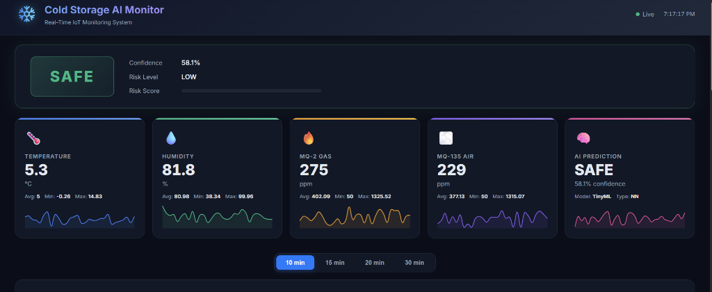
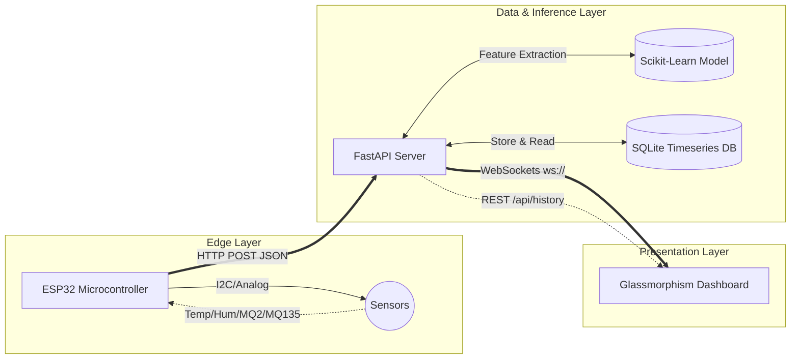

# 🧊 AI-Powered Cold Storage IoT System

An enterprise-grade, end-to-end Machine Learning IoT Pipeline designed for monitoring and predicting hazard states in cold storage and cold chain logistics systems.

## 🌟 Executive Summary

This repository contains the complete source code for a multi-tiered Machine Learning sensor system:
1. **Edge Node (ESP32):** Real-time, ultra-fast polling of Temperature, Humidity, Smoke (MQ-2), and Gas (MQ-135) sensors.
2. **REST API Backend (FastAPI):** High-performance Python backend receiving edge data and executing pre-trained Machine Learning inference via scikit-learn.
3. **Data Persistence (SQLite):** Time-series storage of sensor telemetry and inference confidences.
4. **Live Dashboard:** A beautiful, responsive glassmorphism web interface powered by WebSockets, providing live updates without polling delays.

## 🏗 System Architecture

## 🧠 Machine Learning Engine

The system bypasses heavy Edge AI constraints (like memory swelling and flash overflows frequent in `ArduTFLite`) by offloading inference to the backend. The backend executes a specialized **Logistic Regression** classifier operating on normalized inputs (`StandardScaler`) to deterministically classify environments into `SAFE` or `DANGER` states, complete with probability confidence indices mapping.

## 🚀 Getting Started

If you are cloning this repository to run the project, please view the complete setup instructions here:

👉 **[View the Complete Step-by-Step Implementation Guide](IMPLEMENTATION_GUIDE.md)**

It covers:
* Generating the `.venv` and resolving dependencies.
* C++ toolchains for `pydantic-core`.
* Starting the `uvicorn` local host engine.
* Network protocols to whitelist ESP32 cross-device posts.

## 🛡️ License

This project is released under the standard open-source MIT License.
